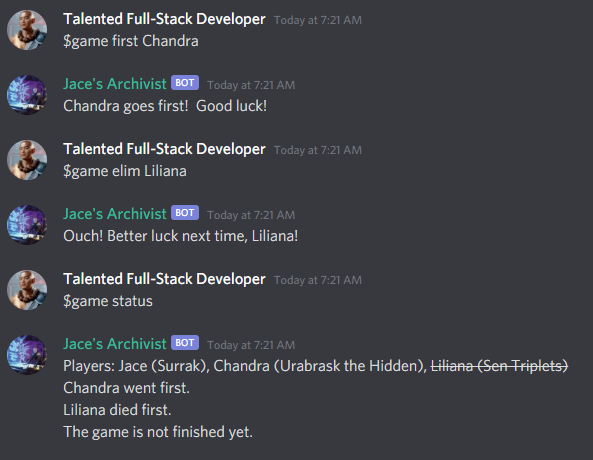
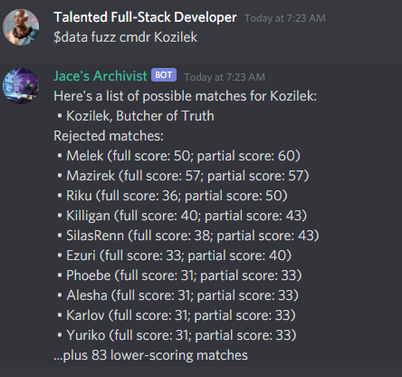
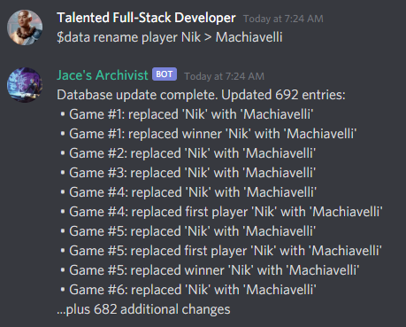

# The Archivist
## *A discord bot for cataloguing your EDH victories*

## Introduction

For the past couple years, my friends and I have engaged in semiregular games of Magic: the Gathering.  Being both competitive and passive-aggressive sorts of people, it is imperative that we know at any given moment whether someone deserves to die for their previous victories.  Fed up with silver tongues and motivated reasoning, we turned to spreadsheets.  The Archivist is the culmination of that project: an automated one-stop shop for data collection, retrieval, and analysis.  You too can partake of statistically justified retribution!

(It's also my first time using Python, so comments and suggestions are welcome!)

## Installation
### Dependencies
First, install python dependencies by opening a terminal in the project folder and typing:
> pip3 install -r requirements.txt

### Bot token
We need to create a new file called "config.py" in the project directory.  The bot token is the first of three values we'll be adding.  If you haven't done this before, you can follow [this guide](https://discordpy.readthedocs.io/en/latest/discord.html) on how to create a bot account with Discord.  

**When assigning permissions:** At this time, minimum required permissions are the "bot" scope and the View Channels, Read Message History, and Send Messages permissions.

Once you've finished setting up permissions, head over to the **Bot** tab and copy the bot's token.  **Do not share this token with anyone, as it can be used to turn your bot against you.**  We will add the token to config.py like so:

> `bot_token = 'bot token here'`

### Output channel and admin id

To complete setup, we need to assign an admin and pick a channel for the bot to post in.  To do that, we need id numbers.  The easiest way to get those is to start the bot with `py -3 main.py`.  (There'll be some errors, but don't worry, we're about to fix those). Since the bot logs information about all incoming messages to the console, you can send a message to the channel you want the bot to post in.

You can find the id of the channel in the 'channel' term (second, after Message) and your account id in the 'author' term.  Enter them into config.py like so:

> `game_channel_id = channel id here`

> `admin_id = account id here`

And that's it!  Restart the bot and you're good to go!

## Features

The Archivist has three main feature families accessed via the `$game`,`$stats`, and `$data` commands.  In the current version, commands can be entered in any channel, but output tends to go to the channel whose id is specified in config.py.  (The bot currently replies to stats commands in the channel the command was sent to.)

(A note on commands: square brackets ( '[' and ']' ) denote *terms to be replaced,* e.g. if the readme tells you a command is `$stats player [name]`, then a search for player Bob would be typed `$stats player Bob`, *without brackets.*)

### Game tracking

TL;DR, The Archivist allows you to track games played with your friends and save them to a persistant location for later analysis or bragging rights.  A complete explanation of the game workflow is available by typing `$game help` while the bot is running, but I'll give an overview here.

1. Before the game begins, players can add themselves to the game with `$game player` followed by their name and the name of their deck, separated by spaces. (The help menu says "commander" but there's currently no reason you couldn't pass deck names for a different MtG format, or even like Pokemon or something)
2. Once the game starts (by choosing a player to go first with `$game first` followed by the name of the player), you can optionally record who dies first with `$game elim` followed by the player's name.
3. Declaring a winner  (`$game winner name goes here`) gives all players the opportunity to leave notes for posterity.
4. Finally, `$game end` saves the game data to the database and clears it from the active game slot.
5. You can type `$game status` at any point to get information on the game.  `$game cancel` will close out the game without saving information.

*Note how the game status strikes out Liliana because the table killed her first (the fate of all Sen Triplets players)*

### Stats Engine

The stats engine lets you retrieve and analyze game data.  Stats commands begin with `$stats` followed by some number of keywords, separated by spaces.  The main functionalities are:

* **Tallies:** `$stats games total`, `$stats games by player`, `$stats games by winner`, and `stats games by deck` are all pretty self-explanatory.
* **Player Performance:** `$stats player [name]` gives a breakdown of a player's win-loss records.
* **Data filtering:** Sometimes you want to see the stats under certain conditions, like how the presence of a certain deck affects your win-loss record.  You can modify the above commands by entering filter terms with `$stats filter` followed by filter terms:
    * `+player=` removes all games from the set where the named player *did not* participate
    * `-player=` removes all games from the set where the named player *did* participate
    * `+deck=` removes all games *without the named deck.* Note that due to how the argument parsing works, you'll need to use underscores instead of spaces, e.g. `+deck=The_Gitrog_Monster`
    * `-deck=` removes all games that *include* the named deck.  Use underscores like above.
    * `+pod=` and `-pod=` let you allow or disallow games with the specified number of players (e.g. -pod=2 removes all 2-player games from the dataset).  You can also use the > and < operators, but at present they're implemented counter-intuitively.  `+pod==` allows *only* the specified number of players and disallows all other options.  Filter arguments are applied left to right, so if you input contradictory pod size requirements, the last one will win.
        * You can use this to your advantage, e.g. by typing `$stats filter +pod==3 +pod=4` to disallow everything besides 3- and 4-player games.
    * You can check what filters are active at any time with `$stats filter settings`.  You can use `$stats refresh` to to reload game data from the history file.  Note that this reapplies filters; if you want to reset the filters, you need to use the `$stats filter reset` command.

Since you probably don't have MtG game data just lying around, I've included our group's file.  I've also included an algorithm for converting game spreadsheets into the game history storage format used by The Archivist.

*The Archivist's player statistics distinguishes between 'duels' (1v1 games) and multiplayer games, since some players (like me) have a different threat level once political options are on the table.  As a side note, I was really proud of that Thantis win.*

*Here's an example of how to use filter terms. These filters ensure that any subsequent calls to the stats methods will only consider multiplayer games where I participated*

### Data Manager

The data manager (DM) is a data sanitization tool mainly used to combat typos and inconsistencies.  (e.g. my Patron of the Moon deck at one point was stored as 'Patron', 'PatronMoon', and 'PatronOfTheMoon' across multiple games, causing the stats engine to think it was actually three different decks).  While the DM shares some features with the stats engine, there is no data contamination between the two (e.g. filter terms don't affect the data manager).  The DM is accessed through the `$data` command and access is locked to the user whose id is identified in config.py as the admin.

* Begin using the data manager by typing `$data load`.  This automatically pulls data from the game history file and backs it up to backup.txt.
* Once data is loaded, you can fuzzy search for terms using `$data fuzz [player or cmdr] [name]` to find all variations of a term in the database.  (The Archivist will also give you the closest rejected matches in case it missed something, but I think right now it's erring on the side of being too generous with the fuzzy search.)
* The DM is currently able to rename player and deck names.  This is done with the `$data rename [player or cmdr] [old name] > [new name]` command.  You can rename multiple targets at once by separating them with the | character, eg:
`$data rename cmdr Nikusar | Nekuzar | Necusar > Nekusar`
    * *All terms and operators must be separated by spaces*
* Once you are satisfied with your changes, you can save them to a text file of your choice with `$data save [destination]`.  The bot's game history is stored in gamehistory.txt by default. **Warning: The save command currently overwrites the destination file without giving any warnings.  Be judicious with your terrible powers.**
* If you're not happy with the changes you've made to the dataset, you can use `$data unload` to clear the DM.
* Changes made to gamehistory.txt won't be reflected in the stats engine until you refresh the stats with `$stats refresh`

*An example of fuzzy search in action.  We can see that my brother's Kozilek deck has been entered both under the complete name and the short name.  To make sure the statistics are as complete as possible, we'd want to choose one or the other and use the rename function.*

*An example of how to use the rename method.  One future development goal is the ability to read the complete log; discord only allows 2000 characters per message*

## Dependencies:

The Archivist owes its existence to discord.py.  Fuzzy search was implemented using the fuzzywuzzy library.

## Planned Future Development:

* A reminder function that messages the Discord server *so people stop forgetting it's game time, Josh*
* A comprehensive fuzzy search method that checks all terms for typos and returns a list of possible matches. This would replace the current typo checking method, which is someone accidentally noticing some games have a typo in the commander name.
* Advanced statistical methods that e.g. calculate the impact of a specific deck's presence to your victory chances
* 'confirm action' checks for the scarier data manager methods
* Ability to rename players and commanders through the $game menu
* $addressme command so the bot can respond to people by name or pronoun; not really vital to the overall plan, but hilarious
* Ability to save inputs as being players or deck names so it stops being an issue when people forget to type "player" in the middle of their commands

## Credits:
* Big thanks to [Jaculabilis](https://github.com/Jaculabilis) for tirelessly recording game data from 2017-2019, and for answering my Python questions.